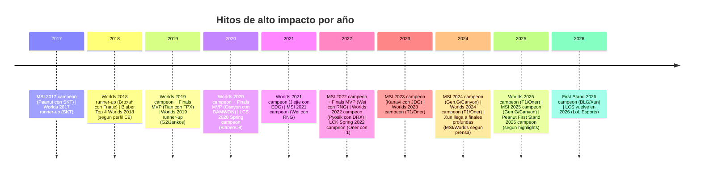
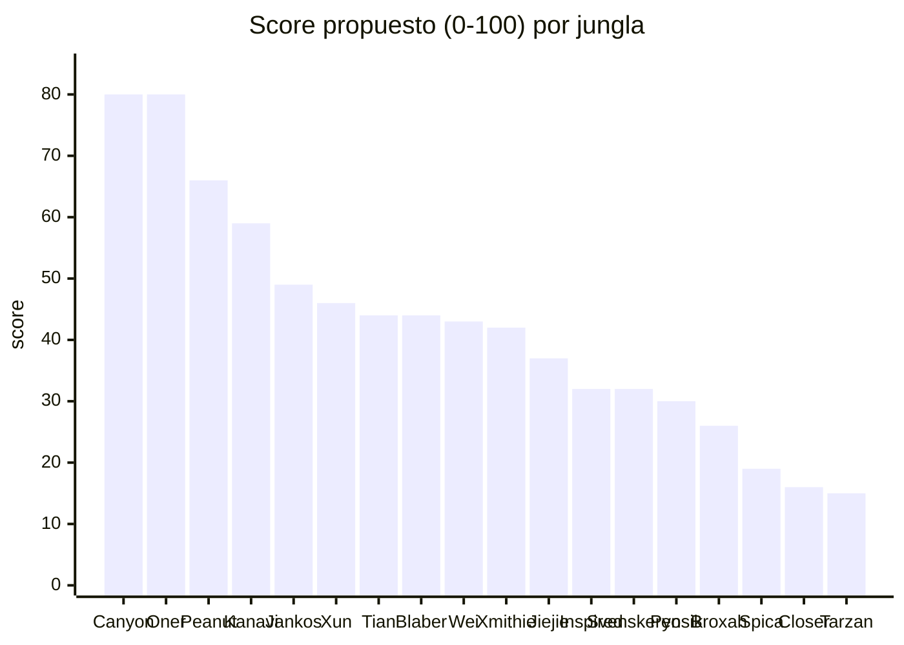

# Tier list analítico de junglas élite de League of Legends con paso por LCS y escena internacional

## Resumen ejecutivo

Este informe arma un **tier list (S/A/B/C)** de junglas “bien buenísimos” (definido como **hardware internacional relevante y/o reconocimiento consistente por analistas y prensa**) con foco en dos grandes grupos:  
- junglas con paso por **League Championship Series (LCS)** (histórica y/o en su retorno 2026)  
- junglas de **equipos internacionales top** (LCK/LPL/LEC) aunque no hayan jugado en LCS, **marcados explícitamente** como “sin LCS”. citeturn12view1turn35search0turn36search0turn37search2

Con una metodología ponderada (detallada más abajo) que prioriza **títulos internacionales (World Championship, MSI y First Stand)**, luego **títulos domésticos**, **premios individuales**, **estadísticas competitivas** y **reputación documentada**, el resultado es:

- **S tier (generacionales / “GOAT-tier” por pico + títulos + consistencia):**  
  - *Canyon* y *Oner* quedan arriba por una combinación rara de **títulos internacionales mayores**, **premios**, y **métricas/impacto** sostenidas en años distintos. citeturn22search5turn19search0turn13search11turn31search0turn28search7
- **A tier (élite mundial, ligeramente por debajo del “techo histórico” del S):**  
  - *Peanut* (longevidad + domestic dominance + MSI + finales) y *Kanavi* (era LPL dominante + MSI + valoración de “mejor jungla del mundo” por ranking especializado) forman el segundo escalón. citeturn36search4turn24search7turn29search5turn27search3turn34search14
- **B tier (élite fuerte; mezcla de campeones del mundo, MVPs LCS/LEC, y/o titles recientes tipo First Stand):**  
  - Incluye perfiles como *Xun* (First Stand 2026 + finales profundas recientes), campeones del mundo como *Tian*, *Jiejie*, *Pyosik*, y “reyes domésticos”/MVPs como *Blaber*, *Xmithie* o *Inspired*. citeturn18search2turn18search6turn4search10turn32search14turn14search10turn37search18turn6search1turn36search5
- **C tier (muy buenos pero con menos “hardware” internacional/doméstico en comparación):**  
  - Casos como *Spica* (pico NA + MVP + innovación), *Tarzan* (premios estadísticos y reconocimiento), *Closer* (pico LCS), y *Broxah* (subcampeón mundial con pico alto pero menos acumulación de títulos) aparecen como “excelentes” pero por debajo del umbral de la élite histórica que define S/A/B en este informe. citeturn26search17turn23search4turn26search11turn33search2

## Alcance, definiciones y fuentes

La población analizada es una lista **curada** (no exhaustiva) de junglas con:  
- **logros internacionales** (ganar o llegar lejos en el **League of Legends World Championship (Worlds)**, el **Mid-Season Invitational (MSI)** o el **First Stand Tournament**) o  
- **reconocimiento consistente** en rankings/análisis (casters/analistas/prensa), especialmente cuando la escena doméstica no dio oportunidades reales de sumar títulos internacionales. citeturn15search7turn17search10turn16search11turn27search3

Se usa como corte temporal práctico **hasta el 29 de marzo de 2026** (fecha actual del informe), y se consideran “recientes” jugadores con impacto fuerte desde ~2017 en adelante (y algunos de legado NA/EU si su palmarés sigue siendo referencia). citeturn12view1turn36search4turn38search0

Contexto clave: **la LCS vuelve en 2026** según comunicación oficial de LoL Esports; esto importa para “actuales” vs “recientes” y para interpretar “LCS” en el período 2023–2025 donde el ecosistema de ligas de Américas tuvo reestructuraciones. citeturn12view1

Fuentes priorizadas (cuando hay disponibilidad):  
- “Oficial-ish” y primarias: **LoL Esports / Riot Games** (sitio y redes verificadas), y publicaciones de medios con material de Riot (por ej. fotos/confirmaciones y recap oficiales). citeturn18search18turn17search2turn21search10turn12view1  
- Estadísticas competitivas: **Games of Legends (gol.gg)** para KDA/KP, pool de campeones y métricas tempranas por torneo y carrera. citeturn19search0turn20search0turn30search1turn18search6  
- Wikis competitivas para palmarés y premios: Leaguepedia (Fandom) + Liquipedia (cuando accesible). citeturn31search0turn13search11turn18search2turn25search0  
- Prensa/analistas: Dot Esports, Inven Global, Red Bull Esports, TyC Sports, ESPN en español, Sheep Esports, entre otros. citeturn28search7turn27search3turn29search1turn34search11turn16search13turn27search19

Limitación metodológica importante: **“participación en objetivos”** no tiene una métrica única estándar por jugador en todas las fuentes. En este informe se usa como proxies:  
- **Kill Participation (KP%)**,  
- **First Blood Participation** (cuando está), y  
- para algunos casos, **control de objetivos del equipo** (dragones/nashors) como contexto de estilo/impacto. citeturn19search0turn20search0turn18search12turn21search15

## Tabla comparativa y scoring

**Leyenda rápida:**  
- “sin LCS” = relevancia internacional sin historial en LCS (marcado por requisito del usuario).  
- Los “títulos principales” listan **solo** hardware respaldado por fuentes citadas en cada fila.  
- “Stats snapshot” = un recorte (torneo icónico o reciente) para KDA/KP y pool. citeturn19search0turn20search0turn30search1turn18search6

| Jugador | Equipos (principalmente) | Años | Títulos principales | Premios individuales | Reputación / comentarios clave + stats snapshot | Nota/score |
|---|---|---:|---|---|---|---:|
| entity["athlete","Kim \"Canyon\" Geon-bu","lol jungler, kr"] *(sin LCS)* | entity["sports_team","Gen.G Esports","lol team, seoul, kr"]; Damwon/DWG KIA/Dplus | 2018–2026 | Worlds 2020 (campeón) + MSI 2024 y MSI 2025 (campeón); 5 títulos LCK. citeturn22search5turn16search13turn17search12turn13search11 | Finals MVP Worlds 2020; MVP LCK Spring 2021. citeturn22search5turn13search8 | Dot Esports lo describe con impacto “insano” y métricas top en playoffs LCK; Team Liquid lo usa como benchmark de “peak skill”. Stats: Worlds 2020 KDA 7.2, KP 69.4%. citeturn1search6turn1search12turn19search0 | 80 |
| entity["athlete","Mun \"Oner\" Hyeon-jun","lol jungler, kr"] *(sin LCS)* | entity["sports_team","T1 (equipo de esports)","lol team, seoul, kr"] | 2020–2026 | Worlds 2023/2024/2025 (campeón). citeturn21search9turn21search3turn20search11 | LCK Finals MVP (Spring 2022); “Jungle of the Year” x4; All‑Pro (varias). citeturn31search0turn31search2 | Sheep Esports lo marca como el más consistente de su equipo en 2025; Dot Esports lo llama “one of the greatest”. Stats: Worlds 2024 KDA 5.9, KP 72.2% (pool: Vi/Skarner/Sejuani, etc.). citeturn28search6turn28search7turn30search1 | 80 |
| entity["athlete","Han \"Peanut\" Wang-ho","lol jungler, kr"] *(sin LCS; retirado)* | SKT/T1; Gen.G; Hanwha Life | 2015–2025 | MSI 2017 (campeón); Worlds 2017 (subcampeón con SKT); 7 títulos LCK; First Stand 2025 (campeón, según highlights). citeturn24search7turn29search5turn36search4 | LCK season MVP; Finals MVP x2; múltiples All‑Pro. citeturn24search0turn36search4 | Sheep Esports resume su narrativa: 7 LCK + 1 MSI, “todavía persigue Worlds”. Contexto estadístico: Worlds 2022 KDA 4.8, KP 67.6%. citeturn27search19turn20search2 | 66 |
| entity["athlete","Seo \"Kanavi\" Jin-hyeok","lol jungler, kr"] *(sin LCS)* | entity["sports_team","Hanwha Life Esports","lol team, seoul, kr"]; JDG; Top Esports | 2019–2026 | MSI 2023 (campeón); 5 títulos LPL; Worlds 2023 (3°–4° con JDG). citeturn0search1turn3search0turn34search14 | “Player of the Year” 2023; All‑Pro LPL (1st/2nd team según temporada). citeturn3search3turn27search3 | Inven Global: “best jungler in the world” por estilo carry; Dot Esports lo trata como “carry jungler” central en power rankings. Stats: MSI 2023 (ej.) Wukong/Sejuani/Maokai con KDA muy alto (Wukong 11.8). citeturn27search3turn27search6turn19search1 | 59 |
| entity["athlete","Marcin \"Jankos\" Jankowski","lol jungler, pl"] *(sin LCS; hoy creador)* | entity["sports_team","G2 Esports","lol team, berlin, de"] | 2014–2023 (pico); 2026 creador | MSI 2019 (campeón) + Worlds 2019 (subcampeón); 5 títulos LEC (según prensa). citeturn8search16turn8search2turn8search4 | — (en este recorte, sin premios “MVP” citados como carga principal). | Dot Esports: “legendary Polish jungler” y uno de los más exitosos de Europa. Stats: Worlds 2019 KDA 3.9; pool: Gragas/Lee Sin/Elise. citeturn8search3turn8search5 | 49 |
| entity["athlete","Peng \"Xun\" Li-Xun","lol jungler, cn"] *(sin LCS)* | entity["sports_team","Bilibili Gaming","lol team, shanghai, cn"] | 2020–2026 | First Stand 2026 (campeón) + LPL 2026 Split 1 (campeón); finales internacionales profundas 2023–2024 (MSI) y Worlds 2024 (finalista). citeturn18search2turn18search15 | “Jungler of the Year” 2024 (LPL). citeturn4search1 | Sheep Esports: detalla su retorno y los picos (finales MSI/Worlds). Stats: First Stand 2026 pool (Pantheon/Poppy/Xin Zhao, etc.) y KDA alto en picks clave. citeturn18search15turn18search6 | 46 |
| entity["athlete","Gao \"Tian\" Tianliang","lol jungler, cn"] *(sin LCS)* | entity["sports_team","Top Esports","lol team, shanghai, cn"]; FPX | 2017–2026 | Worlds 2019 (campeón); LPL Summer 2019 (campeón) como parte del año dominante FPX. citeturn4search10turn19search2 | Finals MVP Worlds 2019; MVP LPL Summer 2019 (regular). citeturn4search10turn4search11 | Perfil de “jungla de presión” del FPX 2019; stats: Worlds 2019 KDA 5.2, KP 69.2%. citeturn4search10turn19search2 | 44 |
| entity["athlete","Robert \"Blaber\" Huang","lol jungler, us"] *(LCS)* | entity["sports_team","Cloud9","lol team, los angeles, us"] | 2018–2026 | Según perfil oficial del club: 4 LCS Championships; Top 4 Worlds 2018; Top 8 Worlds 2021. citeturn37search18turn25search0 | MVP LCS (al menos x2) y honores All‑Pro (según perfil oficial y nota de MVP). citeturn25search4turn37search18 | OneEsports: explica su evolución a jungla más agresivo. Stats: LCS Spring 2020 17–1 con KDA 6.6. citeturn1search20turn25search7 | 44 |
| entity["athlete","Yan \"Wei\" Yangwei","lol jungler, cn"] *(sin LCS)* | entity["sports_team","Invictus Gaming","lol team, shanghai, cn"]; RNG | 2020–2026 | MSI 2021 y MSI 2022 (campeón con RNG); LPL Spring 2021 (campeón) y LPL Spring 2022 (campeón). citeturn17search6turn17search20turn17search10 | Finals MVP MSI 2022. citeturn17search2turn17search10 | En prensa se lo resalta como protagonista (ej. Viego) en la final MSI 2022. Stats: MSI 2022 winrate 83.3% con KDA 7.4. citeturn17search24turn20search0 | 43 |
| entity["athlete","Jake \"Xmithie\" Puchero","lol jungler, na"] *(LCS; retirado)* | entity["sports_team","Team Liquid","lol team, los angeles, us"]; CLG; IMT | 2012–2020 (pico) | 6 títulos LCS; MSI 2019 (subcampeón con TL). citeturn6search1turn9search4 | Finals MVP LCS 2018 Summer. citeturn6search1 | Red Bull sobre MSI 2019 destaca su impacto (ej. Skarner). Stats: LCS Spring Playoffs 2019 KDA 5.9. citeturn9search2turn21search4 | 42 |
| entity["athlete","Zhao \"Jiejie\" Li-Jie","lol jungler, cn"] *(sin LCS)* | entity["sports_team","Weibo Gaming","lol team, shanghai, cn"]; EDG | 2019–2026 | Worlds 2021 (campeón con EDG); LPL Summer 2021 (campeón). citeturn32search14turn32search3 | Presencia en All‑Pro / premios de liga en temporadas posteriores (según compilaciones). citeturn32search8 | Inven Global (análisis) “Canyon Killer”: énfasis en timings y objetivos. Stats: Worlds 2021 KP 74.5% (KDA 3.9; pool: Jarvan/Lee/Viego). citeturn27search2turn32search1 | 37 |
| entity["athlete","Kacper \"Inspired\" Słoma","lol jungler, pl"] *(LCS)* | entity["sports_team","LYON","lol team, americas"]; EG; Rogue | 2019–2026 | LCS champion (con EG 2022 Spring; y en 2026 integra LYON “LCS champion” previo a First Stand). citeturn12search2turn36search5 | MVP LEC 2021 Summer + MVP LCS 2022 Summer. citeturn9search11 | Dot Esports: “único” en ganar MVP en LEC y LCS. Stats: LTA North 2025 Split 2 KDA 12.1. citeturn10search7turn22search10 | 32 |
| entity["athlete","Dennis \"Svenskeren\" Johnsen","lol jungler, dk"] *(LCS; retirado de competir)* | TSM; Cloud9; EG | 2013–2023 | 3 títulos LCS; Worlds 2018 (semifinalista con C9). citeturn11search9turn11search14 | MVP LCS Summer 2019. citeturn5search8 | Riot/Nexus: su relato de crítica y resiliencia. Jensen (cita en ESPN): “Svenskeren” como pieza de sinergia. Stats: Worlds Play‑In 2018 KDA 7.2; KP 82.2%. citeturn38search17turn10search9turn21search1 | 32 |
| entity["athlete","Hong \"Pyosik\" Chang-hyeon","lol jungler, kr"] *(LCS; reciente)* | DRX; Team Liquid; DN SOOPers | 2020–2026 | Worlds 2022 (campeón); paso por LCS con Team Liquid. citeturn14search10turn12search11turn12search0 | Hito llamativo: “primer jungla en LCS en lograr un pentakill” (según notas/recaps). citeturn5search0 | Dot Esports lo entrevista sobre el “miracle run” de DRX. Stats: Worlds 2022 KDA 5.5, KP 69.6%. citeturn12search15turn19search3 | 30 |
| entity["athlete","Mads \"Broxah\" Brock-Pedersen","lol jungler, dk"] *(LCS; hoy creador)* | Fnatic; Team Liquid | 2014–2020 (pico) | Worlds 2018 (subcampeón con Fnatic); EU LCS 2018 Summer (campeón). citeturn33search2 | EU LCS All‑Pro 1st team x2 (2018). citeturn10search4 | Pico competitivo alto (Worlds 2018): KDA 6.2, KP 72.1%. citeturn22search2 | 26 |
| entity["athlete","Mingyi \"Spica\" Lu","lol jungler, us"] *(LCS; reciente)* | TSM | 2019–2022 (pico) | LCS 2020 Summer (campeón). citeturn14search2 | MVP LCS 2021 Summer. citeturn6search2 | Leaguepedia cita a LS diciendo que fue “mejor jungla” y mejor jugador de TSM; Inven Global destaca su innovación (jungle Shen) como clave del run 2020. Stats: Worlds 2020 (pool Nidalee/Graves/Lillia). citeturn37search0turn26search17turn21search2 | 19 |
| entity["athlete","Can \"Closer\" Çelik","lol jungler, tr"] *(LCS; reciente)* | 100 Thieves; Golden Guardians | 2020–2023 (pico) | LCS 2021 Championship (campeón con 100T). citeturn10search1turn26search0 | — (sin MVP oficial citado como carga principal). | ESTNN lo define como “aggressive playmaker” y lo pone como mejor jugador del equipo en Summer 2021. Stats: KP ~70.9% (global). citeturn26search11turn21search7 | 16 |
| entity["athlete","Lee \"Tarzan\" Seung-yong","lol jungler, kr"] *(sin LCS)* | entity["sports_team","Anyone's Legend","lol team, china"]; Griffin; LNG | 2018–2026 | — (sin títulos mayores citados en este recorte). | KDA Leader Jungle (LCK Spring 2019). citeturn23search4turn23search7 | Inven Global lo llama “KING of the jungle”; ONE Esports lo incluye entre “los 5 mejores junglas” rumbo a Worlds 2021. Stats: Worlds 2021 KDA 5.1, KP 71.3%. citeturn23search10turn23search11turn23search0 | 15 |

### Timeline en Mermaid

Los hitos del timeline están respaldados por verificaciones de campeones/MVP y recaps de temporada. citeturn24search7turn29search5turn33search2turn37search18turn4search10turn22search5turn32search14turn17search10turn14search10turn0search1turn21search9turn16search13turn18search2turn12view1

### Gráfico de barras comparando scores

El score es el total ponderado descrito en la sección metodológica y se apoya en palmarés, premios, y snapshots de stats (KDA/KP/pool) con fuentes citadas por fila en la tabla. citeturn19search0turn30search1turn18search6turn6search1turn37search18

## Tier list final

**S tier**  
- *Canyon* — Perfil más completo en este recorte: **Worlds (campeón + Finals MVP)**, **doble MSI con otro core**, y **5 títulos LCK**, con respaldos de analistas sobre dominancia estadística. citeturn22search5turn16search13turn17search12turn13search11turn1search6turn19search0  
- *Oner* — **Tricampeón de Worlds** con alto volumen de premios de liga (Finals MVP + “Jungler of the Year” múltiples) y notas de prensa que lo ponen como “de los más grandes” y el más consistente del roster. citeturn21search9turn20search11turn31search0turn28search6turn28search7  

**A tier**  
- *Peanut* — Caso “GOAT por longevidad”: MSI, subcampeón de Worlds, y **7 títulos LCK** con premios individuales (MVP y Finals MVP). La gran deuda es el Worlds (según perfiles/relatos de prensa). citeturn36search4turn24search0turn29search5turn27search19  
- *Kanavi* — “Carry jungler” de referencia: **MSI 2023 campeón**, **5 LPL**, y reconocido explícitamente como “best jungler in the world” en rankings especializados; sin Worlds, pero con profundidad (SF 2023) y dominio doméstico. citeturn0search1turn3search0turn27search3turn34search14  

**B tier**  
- *Jankos* — El mejor perfil occidental del set por combinación de **MSI + Worlds final + múltiples LEC** y reputación histórica en medios. citeturn8search2turn8search3turn8search16  
- *Xun* — El “hot hand” reciente: First Stand 2026 + títulos LPL 2026 Split 1 y finales internacionales (MSI/Worlds) según prensa; pool flexible y stats fuertes en FST. citeturn18search2turn18search15turn18search6  
- *Tian* — Worlds campeón + Finals MVP (un pico de los más altos del rol), con stats de Worlds 2019 muy sólidas; su score baja por menor acumulación de títulos posteriores en el recorte. citeturn4search10turn19search2  
- *Blaber* — Referencia NA moderna: múltiples títulos y MVPs según perfil oficial; aunque su “techo” internacional no llega a títulos, sí tiene runs relevantes (Top 4/Top 8 Worlds). citeturn37search18turn25search7  
- *Wei* — Doble MSI + Finals MVP 2022 con stats altísimas en ese MSI; hardware doméstico confirmado (LPL Spring 2021/2022) pero sin Worlds en el recorte. citeturn17search10turn17search6turn20search0  
- *Xmithie* — El jungla más ganador históricamente en NA por títulos, con final MSI 2019 y una reputación fuerte de veteranía/shotcalling; cae por era y falta de Worlds titles. citeturn6search1turn9search4turn9search2  
- *Jiejie* — Worlds campeón y pieza clave con estilo elogiado por análisis (“Canyon Killer”); el score es menor porque el recorte de premios acumulados es más corto que S/A. citeturn32search14turn27search2turn32search1  
- *Inspired* — Caso híbrido EU→NA con doble MVP (LEC y LCS) y títulos domésticos relevantes; sin título internacional mayor, pero con métricas recientes muy altas en ligas de Américas. citeturn9search11turn36search5turn22search10  
- *Svenskeren* — MVP LCS y trayectoria con Worlds 2018 profundo; su tier refleja impacto histórico pese a retiro competitivo. citeturn5search8turn11search14turn38search10  
- *Pyosik* — Worlds campeón 2022 y paso por LCS; tier B por “pico máximo” (título mundial) aunque sin acumulación doméstica equivalente en este recorte. citeturn14search10turn12search11turn19search3  

**C tier**  
- *Broxah* — Subcampeón de Worlds 2018 y campeón EU LCS 2018 Summer: pico competitivo muy alto, pero menos acumulación de títulos/premios que el bloque B (en este recorte). citeturn33search2turn10search4turn22search2  
- *Spica* — Pico NA fuerte (título + MVP) y narrativa de innovación (jungle Shen) muy validada por análisis; cae por falta de hardware internacional. citeturn14search2turn6search2turn26search17  
- *Closer* — Campeón LCS con perfil de “playmaker” según prensa, pero sin premios/títulos internacionales. citeturn10search1turn26search11  
- *Tarzan* — Reconocimiento y premios estadísticos (KDA leader) + presencia como top jungler en previas de Worlds; cae por falta de títulos mayores confirmados en el recorte. citeturn23search4turn23search11  

## Metodología de ponderación

El **score propuesto** es **heurístico y auditable**, pensado para capturar “bien buenísimos” como mezcla de **logros** + **premios** + **rendimiento** + **reputación documentada**.

Componentes (máximo 100):

- **Logro internacional (máx. 45):**  
  - Worlds campeón = 15 cada uno; Worlds subcampeón = 7; Worlds semifinal = 4 (cuando está citado). citeturn20search11turn29search5turn34search14  
  - MSI campeón = 7; MSI subcampeón = 4. citeturn16search13turn17search10turn0search1  
  - First Stand campeón = 5; subcampeón = 2 (cuando está citado). citeturn18search2turn36search4  

- **Títulos domésticos (máx. 20):**  
  - 4 puntos por título de liga mayor (LCK/LPL/LEC/LCS), tope 5 títulos para no aplastar el peso internacional. citeturn13search11turn3search0turn6search1turn37search18  

- **Premios individuales (máx. 15):**  
  - Worlds Finals MVP = 6; MSI Finals MVP = 4; MVP de split/temporada liga mayor = 3; “Role of the Year”/equivalentes = 2; All‑Pro 1 punto por mención (hasta tope). citeturn22search5turn17search2turn25search4turn31search0turn24search0  

- **Stats competitivas (máx. 10):**  
  - Se puntúa con evidencia de **KDA/KP/pool** en torneos emblemáticos o de alto nivel. Se priorizan torneos globales (Worlds/MSI/First Stand) y playoffs de ligas mayores cuando se cita explícitamente. citeturn19search0turn20search0turn30search1turn18search6  

- **Reputación / comentarios (máx. 10):**  
  - Se codifica a partir de frases y caracterizaciones de **casters/analistas y prensa** (por ej. “best jungler in the world”, “most feared”, “one of the greatest”), evitando depender solo de opinión comunitaria. citeturn27search3turn28search7turn27search19turn1search12  

En caso de tensión entre **hardware** y **reputación**, el score favorece hardware, pero permite que “picos” (ej. campeón de Worlds) eviten castigos excesivos por falta de títulos domésticos. citeturn14search10turn12search15turn19search3

## Referencias y enlaces

**Resultados y recaps oficiales / semi-oficiales (Riot/LoL Esports):**  
- Confirmaciones de campeones y MVPs (ej. Finals MVP MSI 2022, recap First Stand 2026, retorno LCS 2026). citeturn17search2turn18search18turn12view1  

**Wikis competitivas (palmarés y premios):**  
- Leaguepedia / Liquipedia para títulos, premios por liga, y resultados por jugador. citeturn31search0turn13search11turn25search0turn18search2turn33search2  

**Estadísticas competitivas:**  
- Games of Legends (gol.gg) para KDA/KP, pool de campeones y métricas tempranas por torneo (Worlds/MSI/First Stand/Ligas). citeturn19search0turn20search0turn30search1turn18search6turn25search7  

**Prensa especializada / análisis de talento:**  
- Dot Esports, Inven Global, Sheep Esports, Red Bull Esports, ESPN en español, TyC Sports, entre otros, para caracterizaciones y contexto del “impacto” (no solo resultados). citeturn28search7turn27search3turn27search19turn29search1turn34search11turn16search13