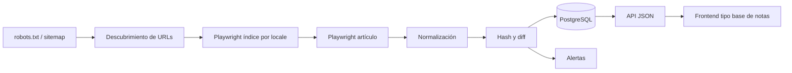
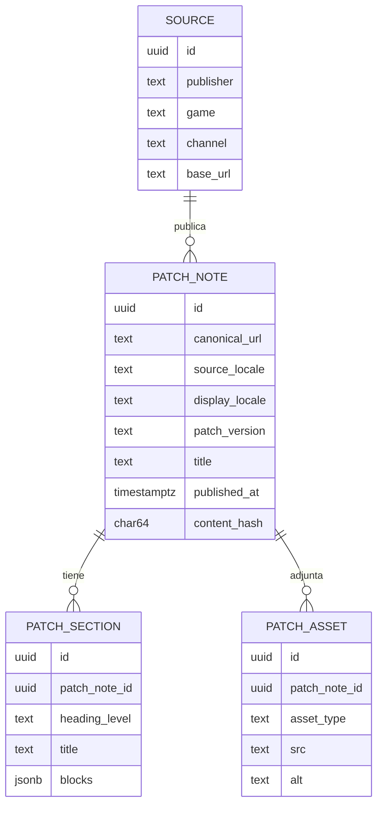

# Fuentes oficiales de Patch Notes y automatización con Playwright

## Resumen ejecutivo

Para **League of Legends**, la fuente canónica hoy es la web oficial de Riot en sus índices de **Patch Notes** por locale (`es-es`, `es-mx`, `en-us`) y los artículos de `news/game-updates/...`, complementados por el **calendario oficial de versiones** en soporte para anticipar ventanas de publicación. Riot **no documenta** un endpoint público específico de patch notes en su catálogo API; en cambio, sí publica **Data Dragon**, `versions.json` y `realms` para enriquecer assets y versionado, aunque con actualización manual y no siempre inmediata. Las **Riot Boards** de LoL ya no son una fuente vigente desde 2020. citeturn1view1turn5view4turn20view0turn25view0turn4view0turn2search1

La estrategia más robusta es: **discovery** por `robots.txt -> sitemap_index.xml` y/o índices por tags; **extracción** con Playwright sobre DOM semántico; **detección de cambios** por hash de contenido normalizado; y **persistencia** en una BD con `canonical_url`, `locale`, `patch_version`, `sections`, `assets` y `content_hash`. Legalmente, Riot exige **registro del producto** si sirve a jugadores, **disclaimer visible**, y que cualquier monetización sea **transformativa** y con **free tier**; además, las reglas de fan content son revocables y en principio no comerciales. Playwright aporta locators con auto-wait/retry, `storageState` para auth futura, `route()` para inspección de red y retries configurables. citeturn1view3turn30view1turn11view1turn24search0turn24search1turn23search1turn23search8

## Fuentes prioritarias

| Fuente | URL | Tipo | Frecuencia | Robots/legal | Estructura de patch notes |
|---|---|---|---|---|---|
| LoL Patch Notes | `https://www.leagueoflegends.com/es-es/news/tags/patch-notes/` + `es-mx` + `en-us` | HTML; discovery adicional por sitemap XML | Aprox. quincenal | `robots.txt` de LoL expone `Allow: /` y sitemap; si tu producto sirve a jugadores, Riot pide registrarlo | Índice con cards, fecha ISO y “VER MÁS”; artículo con `H1`, autor, fecha ISO, `H2/H3/H4`, imágenes y “Related Articles”. citeturn1view1turn1view3turn5view4turn20view0turn30view1 |
| LoL `/dev` | `https://www.leagueoflegends.com/es-es/news/dev/` | HTML | Irregular, ligado a cambios grandes | Misma familia legal/robots que LoL web | Útil para contexto, previews y rationale, no para el changelog canónico. citeturn1view2turn1view3 |
| Calendario oficial | `https://support-leagueoflegends.riotgames.com/hc/es-419/articles/360018987893-Calendario-de-lanzamiento-de-versiones-de-League-of-Legends` | HTML | Calendario anual | Fuente oficial de scheduling | Lista versión→fecha; ideal para cron y alertas de ausencia. citeturn20view0 |
| Data Dragon / Riot APIs | `https://ddragon.leagueoflegends.com/api/versions.json` y `https://developer.riotgames.com/apis` | JSON + assets; API docs | Tras parches, pero manual | Riot puede limitar uso; dev key con límites documentados; no hay endpoint público de patch notes en el catálogo revisado | Útil para assets, idiomas y correlación de versión; **no** como fuente primaria del texto del parche. citeturn4view0turn4view1turn25view0turn11view2 |
| VALORANT | `https://playvalorant.com/es-es/news/tags/patch-notes/` + `https://valorant.dyn.riotcdn.net/x/content-catalog/PublicContentCatalog-release-12.09.zip` | HTML + ZIP/JSON | Aprox. quincenal | `robots.txt` permite `/`; player-data usa RSO/opt-in, pero patch notes son públicas | Buen patrón para reutilizar scraper multi-juego Riot; el catálogo público de assets también se actualiza manualmente. citeturn18view2turn18view0turn29view0 |
| TFT / Wild Rift | `https://teamfighttactics.leagueoflegends.com/es-es/news/` y `https://wildrift.leagueoflegends.com/es-es/news/tags/patch-notes/` | HTML | TFT bi-semanal; Wild Rift con subparches `a/b/c...` | Misma lógica Riot | Estructura editorial muy parecida a LoL; excelente para generalizar selectores. citeturn9search7turn0search4turn26search8 |
| Overwatch | `https://overwatch.blizzard.com/es-es/news/patch-notes/` | HTML | Muy frecuente; live/hotfix por mes | En esta corrida no verifiqué robots primario del dominio | Archivo mensual con fechas, categorías, imágenes de héroes y links a foros oficiales de discusión/bugs/soporte. citeturn18view3 |
| Dota 2 | `https://www.dota2.com/patches` y `https://www.dota2.com/news/updates?l=spanish` | HTML | Irregular, según parche/hotfix | En esta corrida no verifiqué robots primario del dominio | Parches y updates separados; útil como comparación de publisher con page model distinto. citeturn16search0turn16search4turn16search5 |

Como **alerta secundaria**, `@LeagueOfLegends` suele publicar el link del parche el mismo día. Como **foros**, LoL ya no tiene Boards oficiales activos; Overwatch sí enlaza foros oficiales desde sus patch notes. Sobre **cliente del juego** y **APIs privadas**: en la documentación pública revisada no aparece un endpoint documentado de patch notes para el cliente, así que conviene marcarlos como **no especificado** y no basar un MVP en credenciales ni tráfico privado. Además, Riot exige disclaimer visible y registro del producto si sirve a jugadores. citeturn27search1turn2search1turn18view3turn25view0turn30view1

No encontré un **RSS** oficial verificable para LoL/VALORANT en esta revisión; para discovery, el camino más sólido es el **sitemap XML** anunciado en `robots.txt`. citeturn1view3turn18view0

## Estrategia con Playwright

Usaría un pipeline híbrido: **HTTP simple** para `robots.txt` y sitemap, y **Playwright** para índices con “VER MÁS” y parseo consistente de artículos. En LoL, el índice de tags expone cards y “VER MÁS”; los artículos muestran claramente título, fecha ISO, bloques por heading e imágenes. En Playwright, los **locators** son la base porque traen auto-wait y retry; si querés inspeccionar requests JSON/XHR potenciales, `route()`/network funcionan mejor bloqueando service workers cuando faltan eventos. Si alguna fuente futura requiriera auth, Playwright recomienda persistirla con `storageState`; para scraping/crawling en Docker, recomiendan correr con un usuario separado. citeturn1view1turn5view4turn23search1turn24search1turn24search0turn24search18



```ts
import { chromium, type Page } from "playwright";
import { createHash } from "node:crypto";

type Section = { title: string; blocks: string[]; subsections: Section[] };

const LOCALES = ["es-es", "es-mx", "en-us"];
const tagUrl = (lang: string) =>
  `https://www.leagueoflegends.com/${lang}/news/tags/patch-notes/`;

async function collectPatchUrls(page: Page, url: string) {
  await page.goto(url, { waitUntil: "domcontentloaded" });

  const more = page.getByRole("button", { name: /ver más|load more/i });
  while (await more.isVisible().catch(() => false)) {
    const before = await page.locator('a[href*="/news/game-updates/"]').count();
    await more.click();
    await page.waitForFunction(
      (n) => document.querySelectorAll('a[href*="/news/game-updates/"]').length > n,
      before
    );
  }

  return await page.locator('a[href*="/news/game-updates/"]').evaluateAll((els) =>
    [...new Set(
      els.map((e) => (e as HTMLAnchorElement).href)
         .filter((h) => /patch|notes|notas|version/i.test(h))
    )]
  );
}

async function parsePatch(page: Page, url: string) {
  await page.goto(url, { waitUntil: "domcontentloaded" });

  const note = await page.locator("main").evaluate((root) => {
    const title = root.querySelector("h1")?.textContent?.trim() ?? "";
    const publishedAt =
      [...root.querySelectorAll("*")]
        .map((n) => n.textContent?.trim() ?? "")
        .find((t) => /^\d{4}-\d{2}-\d{2}T/.test(t)) ?? null;

    const images = [...root.querySelectorAll("img")]
      .map((img) => ({
        src: (img as HTMLImageElement).src,
        alt: (img as HTMLImageElement).alt || null,
      }))
      .filter((x) => x.src);

    const links = [...root.querySelectorAll('a[href]')].map((a) => ({
      text: a.textContent?.trim() ?? "",
      href: (a as HTMLAnchorElement).href,
    }));

    const sections: Section[] = [];
    let current: Section | null = null;
    let currentSub: Section | null = null;

    [...root.querySelectorAll("h2,h3,h4,p,li")].forEach((el) => {
      const text = el.textContent?.trim();
      if (!text) return;

      if (el.tagName === "H2") {
        current = { title: text, blocks: [], subsections: [] };
        currentSub = null;
        sections.push(current);
        return;
      }
      if (el.tagName === "H3" || el.tagName === "H4") {
        if (!current) return;
        currentSub = { title: text, blocks: [], subsections: [] };
        current.subsections.push(currentSub);
        return;
      }
      if (currentSub) currentSub.blocks.push(text);
      else if (current) current.blocks.push(text);
    });

    return { title, publishedAt, sections, images, links };
  });

  const patchVersion = note.title.match(/(\d+\.\d+[a-z]?)/i)?.[1] ?? null;
  const stableText = JSON.stringify(note.sections);
  const contentHash = createHash("sha256").update(stableText).digest("hex");

  return { url, patchVersion, ...note, contentHash };
}

async function main() {
  const browser = await chromium.launch({ headless: true });
  const context = await browser.newContext({ serviceWorkers: "block" });
  const page = await context.newPage();

  for (const lang of LOCALES) {
    const urls = await collectPatchUrls(page, tagUrl(lang));
    for (const url of urls.slice(0, 5)) {
      const patch = await parsePatch(page, url);
      console.log(JSON.stringify({ locale: lang, ...patch }, null, 2));
    }
  }
  await browser.close();
}

main().catch((err) => {
  console.error(err);
  process.exit(1);
});
```

Para **cambios**, guardá `content_hash` por `canonical_url+locale`; si cambia, generá una nueva revisión. Para **rate limits**, tratá Riot API/Data Dragon como enriquecimiento separado y con throttling: Riot documenta límites y se reserva el derecho de cambiarlos o bloquear sobreuso; Data Dragon además puede quedar atrasado respecto del parche. En HTML público, mantené baja concurrencia, retries con backoff, y usá proxies solo si necesitás una locale/región específica o una salida corporativa estable. Si por “CloudCode” te referías a **Google Cloud Code**, sirve como plugin de IDE para desarrollo local/containers; si querías decir **Claude Code**, Playwright hoy tiene CLI/MCP oficial y buen soporte de debugging. citeturn11view2turn4view0turn23search8turn23search0turn23search13turn23search25

## Modelo de datos

Para ordenar, filtrar y comparar, conviene separar **nota**, **secciones**, **assets** y **fuente**. Además, como LoL web publica español en `es-ES` y `es-MX` pero Data Dragon soporta `es_AR`, vale la pena modelar `source_locale` y `display_locale` por separado. citeturn0search0turn3search0turn4view0

| Campo | Tipo | Uso | Índice |
|---|---|---|---|
| `id` | `uuid` | PK | PK |
| `publisher` | `text` | `riot`, `blizzard`, `valve` | btree |
| `game` | `text` | `lol`, `valorant`, `tft`, `wildrift` | btree |
| `channel` | `text` | `site`, `dev`, `support`, `social`, `api_assets` | btree |
| `source_locale` | `text` | `es-es`, `es-mx`, `en-us` | btree |
| `display_locale` | `text` | `es-AR` para UI si traducís/corregís | btree |
| `patch_version` | `text` | `26.10`, `7.1e`, `12.09` | btree |
| `title` | `text` | título visible | FTS |
| `canonical_url` | `text` | dedupe fuerte | unique |
| `published_at` | `timestamptz` | orden cronológico | desc btree |
| `fetched_at` | `timestamptz` | auditoría | btree |
| `content_hash` | `char(64)` | detección de cambios | btree |
| `summary` | `text` | teaser/lead | FTS |
| `sections` | `jsonb` | estructura H2/H3/H4 | GIN |
| `images` | `jsonb` | hero, highlights, skins | GIN |
| `links` | `jsonb` | cross-links, related articles | GIN |
| `authors` | `text[]` | firma editorial | GIN |
| `raw_html_ref` | `text` | snapshot en object storage | — |
| `scraper_version` | `text` | trazabilidad | — |



Ejemplo de salida JSON:

```json
{
  "publisher": "riot",
  "game": "lol",
  "channel": "site",
  "source_locale": "es-es",
  "display_locale": "es-AR",
  "patch_version": "26.10",
  "title": "Notas de la versión 26.10",
  "canonical_url": "https://www.leagueoflegends.com/es-es/news/game-updates/patch-26-10-notes",
  "published_at": "2026-05-12T18:00:00.000Z",
  "content_hash": "sha256:...",
  "sections": [
    {
      "title": "Campeones",
      "subsections": [
        { "title": "Aatrox", "blocks": ["Passive - ...", "Q - ..."] }
      ]
    }
  ],
  "images": [
    { "src": "https://cmsassets.rgpub.io/...", "alt": "Patch Highlights" }
  ],
  "links": [
    { "text": "TFT patch notes here", "href": "https://teamfighttactics.leagueoflegends.com/..." }
  ]
}
```

## Cumplimiento legal y ética

En Riot, el marco más claro es: si tu producto **sirve a jugadores**, debés **registrarlo** aun si no usa APIs documentadas; debés publicar el **disclaimer legal** visible; si monetizás, necesitás **free tier** y contenido **transformativo**; además, Riot permite proyectos de fans bajo una licencia **limitada, revocable y en principio no comercial**. En LoL, el boilerplate sugerido por Riot es explícito y conviene copiarlo tal cual. citeturn30view1turn30view3turn11view1

Ética y operación: no uses **APIs privadas** ni tráfico del **cliente** como dependencia base sin permiso, no asumas credenciales, y no presentes redes o comunidades no oficiales como fuente primaria. Para reducir riesgo de copyright, mostrale al usuario el **título, resumen estructurado, assets permitidos y link canónico**, y evitá republicar innecesariamente el artículo entero cuando alcanza con la experiencia transformativa de búsqueda, filtros, diffs y navegación. También conviene no inferir datos competitivos ocultos: Riot prohíbe productos que usen información no accesible por gameplay normal para dar ventaja. Como contraste entre publishers, Epic sí publica un `robots.txt` con varias rutas y queries en `Disallow`, así que conviene revisar publisher por publisher. citeturn25view0turn30view1turn30view3turn18view1

## Mantenimiento operativo

El scraper tiene que comportarse como un sistema, no como un script. Recomiendo **smoke tests** diarios, **contract tests** de selectores (`main h1`, fecha parseable, al menos una sección), snapshots del JSON normalizado y reportes HTML de prueba. Playwright trae assertions asíncronas, retries configurables y debugging integrado, lo que simplifica detectar roturas de markup. citeturn23search3turn24search15turn23search8turn24search10turn23search25

Para monitoreo, usá tres alertas simples: `0` URLs nuevas cerca de una fecha esperada del calendario oficial; artículo nuevo con `sections.length === 0`; y cambio de `content_hash` post-publicación. El cron ideal es uno liviano diario y otro reforzado alrededor de las fechas oficiales del calendario. Si necesitás selector discovery local, `page.pickLocator()` y el debugger de VS Code ayudan bastante; para entornos contenedorizados, Playwright documenta bien Docker. citeturn20view0turn23search18turn24search18

## Frontend y UX

Como las notas oficiales están fuertemente jerarquizadas por encabezados e imágenes, una UX buena debería respetar esa estructura: **lista-detalle**, **TOC sticky** por secciones, filtros por `game`, `patch_version`, `locale`, `channel` y fecha, más búsqueda full-text. En LoL y Overwatch, la jerarquía editorial (`H2/H3/H4`, héroes/campeones, highlights, bugfixes) justifica accordions, anchors compartibles y vista “diff” entre parches o entre `es-MX`/`es-ES`/`en-US`. citeturn5view4turn18view3

Para un frontend tipo base de notas, yo priorizaría: orden por fecha descendente, chips por versión, badge de “oficial”, toggle de locale, tarjetas relacionadas, y una vista “comparar” que contraste dos versiones o dos locales. El valor diferencial no es copiar la web del publisher, sino volver navegable el corpus: **qué cambió**, **dónde cambió**, **cuándo salió**, **en qué idioma está**, y **cuál es la fuente canónica**. citeturn20view0turn5view4turn27search1